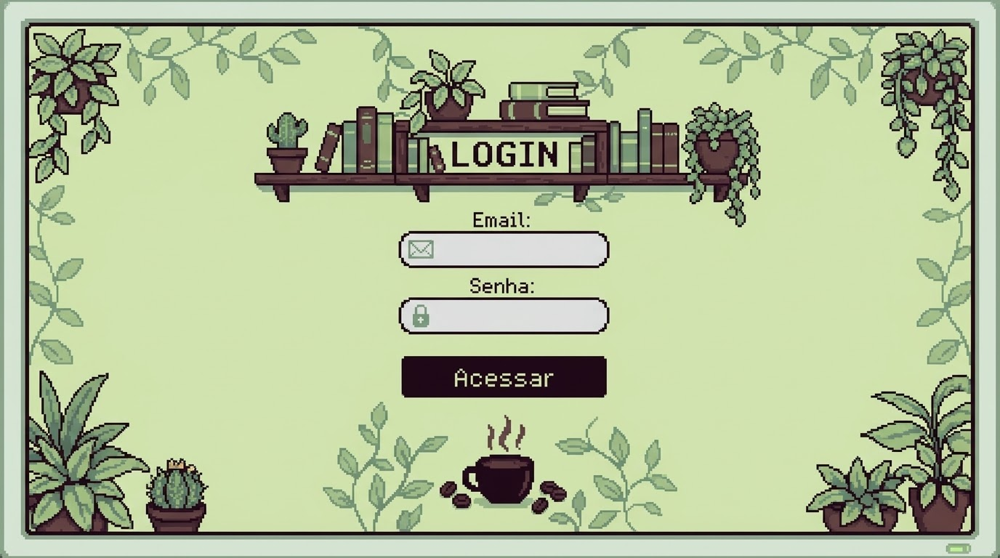
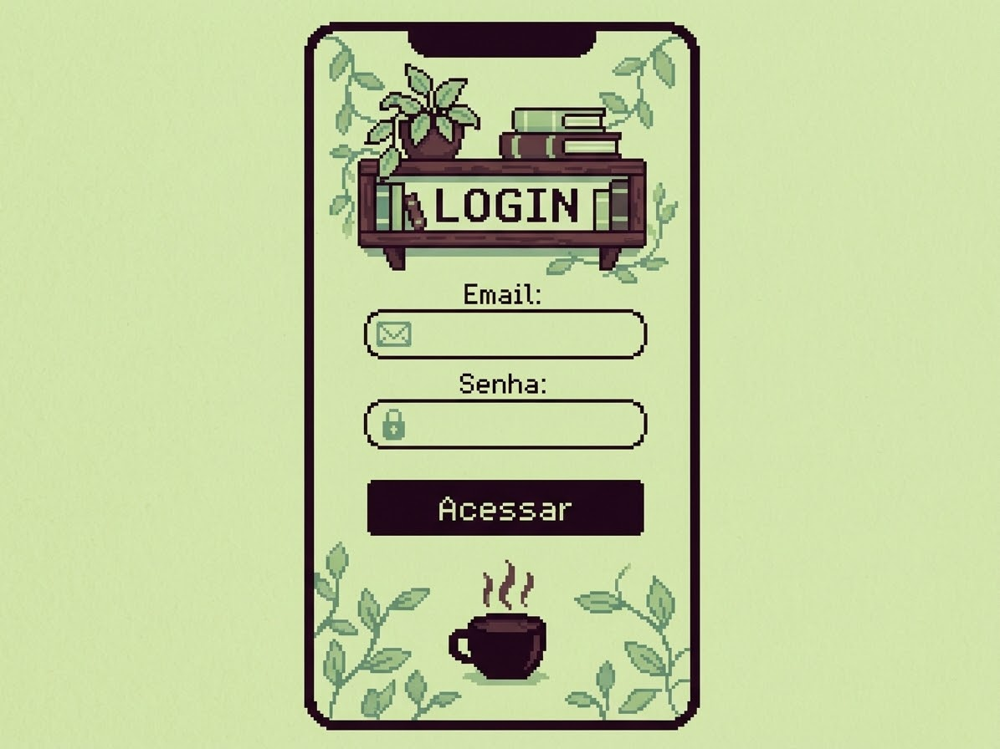
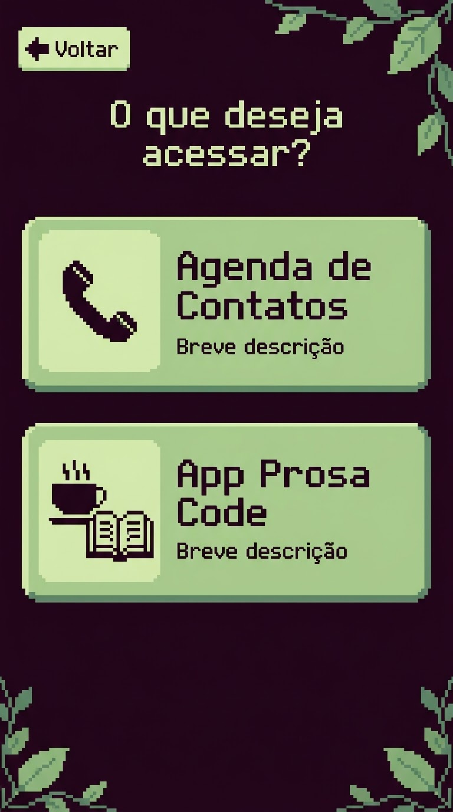

# 🎨 Mockups — Sistema de Login e Portal de Acesso

Nesta pasta estão os protótipos de alta fidelidade desenvolvidos exclusivamente para o **Módulo de Autenticação e Seleção de Acesso** da Prosa Code.

---

## 📱 1. Telas de Autenticação (Login)

### Versão Desktop vs. Versão Móvel
| Versão Desktop | Versão Móvel |
| :---: | :---: |
|  |  |

* **Campos:** Entrada de *E-mail* e *Senha* com ícones em *pixel art*.
* **Identidade:** Visual aconchegante com estante de livros, plantas e xícara de café.

---

## 🔀 2. Tela de Seleção de Acesso (Hub)

Ecrã exibido após o login bem-sucedido para direcionar o usuário ao módulo desejado:

  

* **Direções:**
  - 📞 **Agenda de Contatos**
  - ☕📚 **App Prosa Code** (Sistema do Sebo)

---

## 🎬 3. Tela inicial (animação de entrada)

* 📹 **Vídeo de Demonstração:** [`prosa-code-login.mp4`](prosa-code-login.mp4)
* **Fluxo:** Boas-vindas animadas ➔ Transição em píxeis ➔ Tela de Login.
